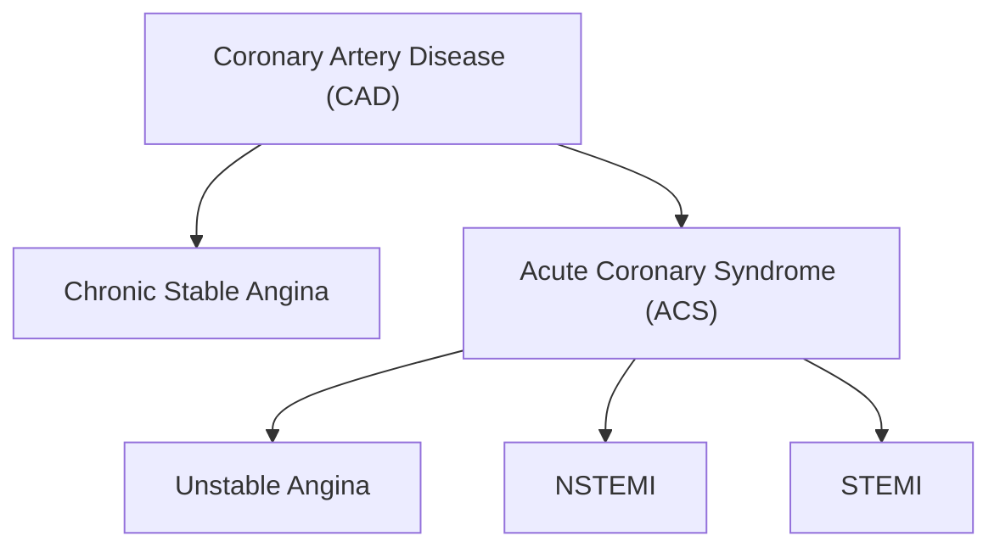

---
{"dg-publish":true,"permalink":"/USMLE/Cardiology/Acute coronary syndrome/"}
---

# Etiology

---
# Pathophysiology
## Possibilities
1. Left anterior descending artery (45%): infarction of the anterior wall and anterior septum of the LV
2. Right coronary artery: infarction of the posterior wall, posterior septum, and papillary muscles** of the LV
3. Left circumflex artery: infarction of the lateral wall of the LV
# LV vs RV
| Feature                       | Left Ventricle       | Right Ventricle                                                                 |
| ----------------------------- | -------------------- | ------------------------------------------------------------------------------- |
| **Muscle mass**               | High                 | Low                                                                             |
| **Resting oxygen extraction** | High                 | Low                                                                             |
| **Coronary perfusion**        | During diastole only | Throughout cardiac cycle |
| **Collateral circulation**    | Less developed       | More developed                                                                  |
| **Ischemic preconditioning**  | Low                  | High                                                                            |

The relatively low systolic pressure of the RV (eg, ≤25 mm Hg) allows for coronary perfusion throughout the cardiac cycle

---
# Clinical features

---
# Diagnostics
## Pathology

| Time After Myocardial Infarction | Predominant Light Microscopic Changes                                                                    |
| -------------------------------- | -------------------------------------------------------------------------------------------------------- |
| 0-4 hours                        | No visible change                                                                                        |
| 4-12 hours                       | Wavy fibers with narrow, elongated myocytes                                                              |
| 12-24 hours                      | Myocyte hypereosinophilia with pyknotic (shrunken) nuclei                                                |
| 1-3 days                         | Coagulation necrosis (loss of nuclei & striations) Prominent neutrophilic infiltrate                  |
| 3-7 days                         | Disintegration of dead neutrophils & myofibers Macrophage infiltration at border areas                |
| 7-10 days                        | Robust phagocytosis of dead cells by macrophages Beginning formation of granulation tissue at margins |
| 10-14 days                       | Well-developed granulation tissue with neovascularization                                                |
| 2-8 weeks                        | Progressive collagen deposition & scar formation                                                         |

---
# Treatment
## Arrythmia 
**Class IB [[USMLE/Pharmacology/Antiarrhythmic drugs\|antiarrhythmics]]** treat ventricular arrhythmias, especially in ischemic tissue (e.g. **post-MI**)
>[!note] 
>**Ischemia leads to slow cellular depolarization that inactivates sodium channels, and therefore enhanced binding of IB drugs**.

---
# Complications
| Complication                  | Time course                 | Clinical findings                                                                 |
|-------------------------------|-----------------------------|-----------------------------------------------------------------------------------|
| Papillary muscle rupture/dysfunction* | Acute or within 3-5 days   | Severe [[USMLE/Reproductive/Pulmonary edema\|pulmonary edema]], respiratory distress New early systolic murmur (acute MR) Hypotension/cardiogenic shock  |
| Interventricular septum rupture | Acute or within 3-5 days   | Chest pain New holosystolic murmur Hypotension/cardiogenic shock Step up in O2 level from RA to RV |
| Free wall rupture**            | Within 5 days or up to 2 weeks | Chest pain Distant heart sounds Shock, rapid progression to cardiac arrest   |
| Left ventricular aneurysm**    | Up to several months        | [[USMLE/Cardiology/Heart failure\|Heart failure]] [[USMLE/Cardiology/Coronary artery disease\|Angina]], ventricular arrhythmias                                  |
*Usually due to right coronary artery occlusion.

**Usually due to left anterior descending artery occlusion

## 0–24 hours post-infarction
- Sudden cardiac death (SCD)
	- Definition: A sudden death presumably caused by cardiac arrhythmia or hemodynamic catastrophe, which occurs either within an hour of symptom onset in patients with cardiovascular symptoms, or within 24 hours of being asymptomatic in patients with no cardiovascular symptoms. 
	- Pathophysiology: Fatal ventricular arrhythmia is considered to be the underlying mechanism of SCD. 
	- Underlying conditions
		- [[USMLE/Cardiology/Coronary artery disease\|Coronary artery disease]]: present in ∼ 70% of cases in adults over 35 years 
		- [[USMLE/Cardiology/Dilated cardiomyopathy\|Dilated cardiomyopathy]]/[[USMLE/Cardiology/Hypertrophic cardiomyopathy\|hypertrophic cardiomyopathy]]
		- [[USMLE/Cardiology/Myocarditis\|Myocarditis]]
		- Hereditary ion channelopathies (e.g., long QT syndrome, Brugada syndrome)
	- Prevention: installation of the implantable cardioverter-defibrillator device 
- Arrhythmias: a common cause of death in MI patients in the first 24 hours 
	- Sinus bradycardia is the most common arrhythmia, especially in inferior wall myocardial infarction
		- Due to occlusion of the right coronary artery (RCA).  The RCA usually supplies blood to the sinoatrial node, the atrioventricular node, and most of the bundle of His
		- Managed with intravenous atropine
	- Ventricular tachyarrhythmias
	- [[USMLE/Cardiology/Atrioventricular block\|Atrioventricular block]] (e.g., complete heart block)
	- Conduction blocks
## 1–3 days post-infarction
- Early infarct-associated [[USMLE/Cardiology/Pericarditis\|pericarditis]]
	- This [[USMLE/Cardiology/Pericarditis\|pericarditis]] is a reaction to necrosis of the myocardium near the epicardial surface; usually localized to the areas overlying the necrotic myocardial segment.
	- Clinical features of acute [[USMLE/Cardiology/Pericarditis\|pericarditis]], including:
		- Friction rub
		- Pleuritic chest pain
		- Dry cough
			- Due to inflammation of the mediastinal pleura adjoining the pericardium.
		- Diffuse ST elevations on ECG
		- [[USMLE/Cardiology/Pericardial effusion and cardiac tamponade\|Pericardial effusion]]
	- Prognosis: usually self-limiting

>[!tip] 
>- Early: peri-infarction [[USMLE/Cardiology/Pericarditis\|pericarditis]]
>- Late: Dressler syndrome
## 2 weeks to months post-infarction
### Postmyocardial infarction syndrome (Dressler syndrome)
**[[USMLE/Cardiology/Pericarditis\|Pericarditis]]** occurring 2–10 weeks post-MI without an infective cause 
- Pathophysiology: thought to be due to circulating antibodies against cardiac muscle cells (autoimmune etiology) → immune complex deposition → inflammation
- Clinical features
	- Signs of [[USMLE/Cardiology/Pericarditis\|Pericarditis]]: pleuritic chest pain , dry cough , friction rub
	- Fever
	- Laboratory findings: leukocytosis, ↑ serum troponin levels
	- ECG: diffuse ST elevations
- Treatment: [[USMLE/Pharmacology/Non-opioid analgesics\|NSAIDs]] (e.g., aspirin), colchicine
- Complications (rare): hemopericardium
