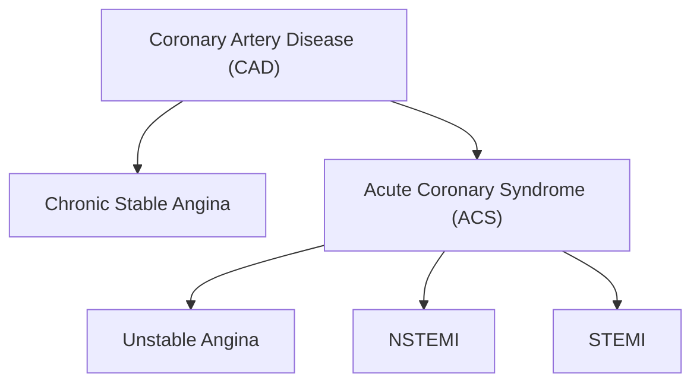

---
{"dg-publish":true,"permalink":"/USMLE/Cardiology/Coronary artery disease/","tags":["t1"]}
---

# Definitions
---

## Coronary artery disease
- Coronary artery disease (CAD): ischemic heart disease due to narrowing or blockage of coronary arteries, most commonly due to atherosclerosis, resulting in a mismatch between myocardial oxygen supply and demand
- Stable CAD: a form of CAD in which patients are either asymptomatic or have stable or low-risk unstable angina; also used for patients with a history of MI whose symptoms are controlled with treatment
## Chest pain and angina
### Preferred terminology for types of chest pain 
- Cardiac chest pain: likely associated with cardiac ischemia based on symptoms (e.g., central, retrosternal, squeezing, exertional).
- Possible cardiac chest pain: may be associated with cardiac ischemia based on symptoms (e.g., stabbing, tearing, ripping, burning).
- Noncardiac chest pain: unlikely associated with cardiac ischemia based on symptoms (e.g., positional, fleeting).
### Historical terminology for types of chest pain 
The following terms are no longer recommended for use in the 2021 AHA/ACC chest pain guidelines. 
- Typical angina fulfills all of the following criteria:
	- Retrosternal chest pain of characteristic nature and duration (e.g., transient retrosternal pressure)
	- Provoked by exertion or emotional stress
	- Relieved by rest and/or nitroglycerin
- Atypical angina: fulfills only two of the aforementioned criteria
- Nonanginal chest pain: fulfills one or none of the aforementioned criteria
# Epidemiology

---
# Etiology

---
# Pathophysiology
- Patients with CAD usually become symptomatic when the degree of coronary stenosis reaches ≥ 70%.

| Feature              | Stable Plaque                                                                                                                                                                          | Unstable (Vulnerable) Plaque              |
| :------------------- | :------------------------------------------------------------------------------------------------------------------------------------------------------------------------------------- | :---------------------------------------- |
| **Fibrous Cap**      | Thick, strong, intact                                                                                                                                                                  | Thin, weak, prone to rupture/erosion      |
| **Lipid Core**       | Smaller, less necrotic                                                                                                                                                                 | Larger, highly necrotic, soft             |
| **Inflammation**     | Low                                                                                                                                                                                    | High (active macrophages, MMPs)           |
| **Smooth Muscle**    | More, synthesizing collagen                                                                                                                                                            | Fewer, more apoptosis                     |
| **Primary Problem**  | Slow development.  Allow the development of viable collateral vessels | Rupture/Erosion & Thrombosis              |
| **Clinical Risk**    | Stable Angina, Claudication                                                                                                                                                            | Acute Coronary Syndromes (MI, UA), Stroke |
| **Acute Event Risk** | Lower                                                                                                                                                                                  | Higher                                    |

# Clinical features
---
## Stable angina
- Symptoms are reproducible/predictable and severity, frequency, and threshold for reproduction of symptoms do not change.
- Symptoms often subside within minutes with rest or after administration of nitroglycerin 
- Common triggers include physical/mental stress or exposure to cold

---
# Diagnostics

---
# Treatment
## Approach
- All patients: pharmacotherapy for CAD
	- Start prevention of recurrent CAD, i.e., antiplatelet agents, statins, and management of comorbidities.
	- Start antianginal medication.
## Pharmacotherapy for CAD
### Antianginal drugs
- Goal: reduction of myocardial oxygen demand (MVO2)
- First-line agent: [[USMLE/Cardiology/Beta blockers\|beta blockers]]
- Second-line agents: [[USMLE/Pharmacology/Calcium channel blockers\|CCBs]], [[USMLE/Pharmacology/Nitrates\|nitrates]], ranolazine
- Third-line agent: Consider ranolazine if beta-blockers, [[USMLE/Pharmacology/Calcium channel blockers\|CCBs]], and [[USMLE/Pharmacology/Nitrates\|nitrates]] are ineffective or not tolerated.

### Prevention of recurrence and/or progression
- Antiplatelet agents
- ACEIs or ARBs
- [[USMLE/Cardiology/Beta blockers\|Beta blockers]]

# Subtypes and variants
---
## Vasospastic angina
Previously known as variant or Prinzmetal angina
### Description
- Angina caused by transient coronary spasms (usually due to spasms occurring close to areas of coronary stenosis)
- Not affected by exertion (may also occur at rest)
- Typically occurs early in the morning
### Etiology
- Cigarette smoking; use of stimulants (e.g., cocaine, amphetamines), alcohol, or triptans
- Stress, hyperventilation, exposure to cold
- Common atherosclerotic risk factors (except smoking) do not apply to vasospastic angina.
### Pathogenesis
- Hyperreactivity of coronary smooth muscle due to endothelial dysfunction & autonomic imbalance
	- Triggered by excess vagal tone, and they occur most commonly at night when vagal tone is at a peak.
	- Both [[USMLE/Neurology/Neurotransmitters\|acetylcholine]] and ergot alkaloids (eg, dihydroergotamine) provoke symptoms and may also aid in diagnosis, as follows:
		- Acetylcholine normally stimulates endothelial muscarinic receptors to cause vasodilation via increased release of nitric oxide.  However, a deficiency of endothelial nitric oxide in affected patients causes increased vagal tone to instead trigger vasoconstriction and precipitate vasospastic symptoms.
		- Ergot alkaloids activate 5-HT2 serotonergic receptors to cause vasoconstriction.  Normally, the vasoconstriction is somewhat offset by endothelial release of vasodilatory prostaglandins, but this response is lacking in affected patients due to endothelial dysfunction.
### Clinical presentation
- Young age (<50)
- Minimal CAD risk factors (other than smoking)
- Recurrent chest discomfort
	- At rest or during sleep
	- Spontaneous resolution ≤15 min
### Diagnosis
- ECG: ST-segment elevation during episode
- Coronary angiography: no CAD
### Treatment
- Smoking cessation
- Avoid beta-blockers (particularly nonselective beta blockers), and other agents that induce vasoconstriction
	- Blockade of beta-2 receptors prevents smooth muscle cell relaxation and may cause additional vasoconstriction.
- First-line therapy: calcium channel blockers, e.g., verapamil, diltiazem, or nifedipine
